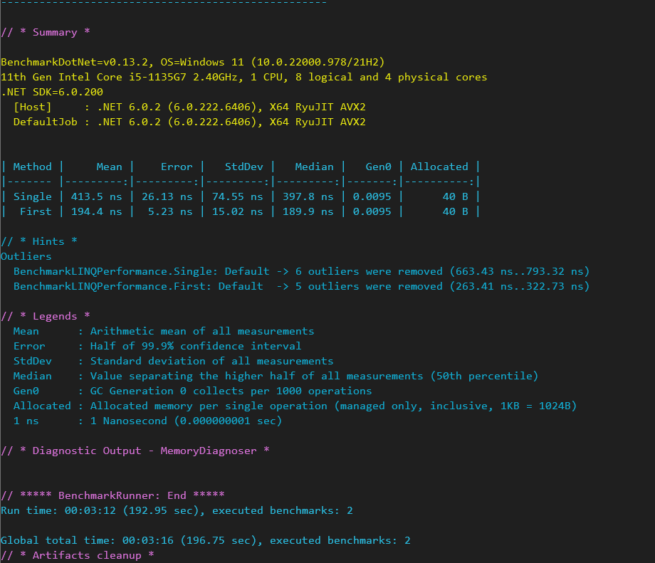

# Benchmarking console app with dotnet 6

## Benchmarking LINQ Performance
 - This is a simple exmaple that benchmarks the performance of the Single and First methods of LINQ.
 
 

###### Interpreting the Benchmarking Results
 - For each of the benchmarked methods, a row of the result data is generated. The benchmark results show the mean execution time, garbage collections (GCs), and the allocated memory.

 - The Mean column shows the average execution time of both the methods. As is evident from the benchmark results, the First method is much faster than the Single method in LINQ. The Allocated column shows the managed memory allocated on execution of each of these methods. 

 - Here's what each of the legends represent:

 - *Method*: This column specifies the name of the method that has been benchmarked.
 - *Mean*: This column specifies the average time or the arithmetic mean of the measurements made on execution of the method being benchmarked.
 - *StdDev*: This column specifies the standard deviation, i.e., the extent to which the execution time deviated from the mean time.
 - *Gen 0*: This column specifies the Gen 0 collections made for each set of 1000 operations.
 - *Allocated*: This column specifies the managed memory allocated for a single operation.

